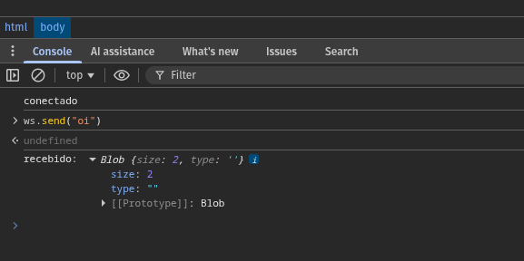

# WEBSOCKET SERVER - MULTI-ROOM BROADCAST

**Categoria**: Streaming
**Tempo**: 1h (deixa uns 20min de buffer pra rodar, testar e ajustar)

## Estudo antes (10-15min):

Foco específico: o padrão read pump / write pump por conexão WebSocket — por que cada conexão precisa de duas goroutines separadas (uma lendo do socket, outra escrevendo), e por que você nunca deve escrever no mesmo *websocket.Conn de duas goroutines diferentes ao mesmo tempo. Dá uma olhada rápida na doc do gorilla/websocket (ou nhooyr.io/websocket, sua escolha) — especificamente a seção de "Concurrency" no README do gorilla. Você já resolveu esse problema de "múltiplos writers pro mesmo destino" no TCP chat server — pensa em como aquilo se aplica aqui.

**Contexto**:

Você está construindo o backend de um sistema de chat de suporte ao vivo (tipo Intercom/Zendesk chat) pro CoffePlace. Cada "room" representa uma conversa entre um cliente e o time de suporte. Múltiplos clientes podem estar conectados simultaneamente, cada um em uma ou mais rooms, e mensagens enviadas numa room devem ser distribuídas (broadcast) para todos os outros clientes conectados naquela mesma room — mas não para clientes de outras rooms.

**O que construir**:

Um servidor WebSocket em Go que gerencia múltiplas rooms de chat, onde clientes entram em uma room via query param ou path (/ws?room=support-123), enviam mensagens em JSON, e recebem broadcast de mensagens de outros clientes na mesma room.

**Requisitos obrigatórios**:

- Upgrade de conexão HTTP para WebSocket usando gorilla/websocket (ou lib equivalente)
- Suporte a múltiplas rooms simultâneas, identificadas por string
- Cliente entra numa room ao conectar; mensagem enviada só chega pros outros clientes da mesma room
- Read pump e write pump separados por conexão (goroutines independentes)
- Cleanup correto quando um cliente desconecta (remove da room, fecha channels, sem leak de goroutine)
- Graceful shutdown do servidor inteiro (contexto ou signal) que fecha todas as conexões ativas de forma limpa
- Mensagens em JSON com pelo menos: type, room, content, timestamp

**Bonus** (se sobrar tempo):

- Ping/pong heartbeat pra detectar conexões mortas (client não fecha o socket mas para de responder)
- Endpoint que lista quantos clientes estão ativos por room

**O que será observado**:

Como você estrutura a concorrência entre a goroutine que gerencia o estado das rooms (hub) e as goroutines de cada conexão — e como você evita race conditions no acesso ao mapa de clientes/rooms sem travar tudo com um mutex gigante.

---

## Por que o WebSocket exige leitura e escrita em goroutines separadas

Um `*websocket.Conn` é, por baixo dos panos, uma única conexão TCP com uma camada de framing por cima (o protocolo WebSocket empacota mensagens em frames). A biblioteca (`gorilla/websocket` incluso) garante duas coisas, e só duas:

1. É seguro ter uma goroutine lendo enquanto outra escreve: leitura e escrita concorrentes entre si são ok.
2. NÃO é seguro ter duas goroutines escrevendo ao mesmo tempo (nem duas lendo ao mesmo tempo, mas isso é menos comum de precisar).

Por quê? 

Pois escrever em uma conexão WebSocket **não é um write() atômico de socket puro**. Esse processo envolve:

- Montar um frame (header + payload, possivelmente fragmentado e possivelmente com máscara no caso de mensagens do lado do client).
- Se duas goroutines chamarem `conn.WriteMessage()` ao mesmo tempo, os bytes dos dois frames podem **intercalar** no meio do envio.
- O outro lado da conexão recebe um frame corrompido, porque o "delimitador" de onde um frame termina e outro começa ficou bagunçado.

E o pior disso: não dá erro em Go nenhum, não é algo que o `-race` vai detectar, o bug vai aparecer do outro lado como mensagem ilegível ou conexão fechada com erro estranho.

### Por que precisamos ter duas goroutines nesse cenário (read pump / write pump)

- Você precisa **ler continuamente** do socket, se não o cliente nunca consegue mandar nada novo, e frames de controle tipo pong ou close nunca são processados.
- Você também precisa **escrever** sempre que o hub / room decidir fazer o broadcast de algo para esse cliente.

Essas duas coisas acontecem em momentos diferentes e por gatilhos diferentes:

- Leitura é gatilhada pelo cliente que manda algo
- Escrita é galhada por OUTRO cliente da room mandando uma mensagem que precisa ser repassada

Dai ficaria bloqueado esperando ler algo do cliente A, uma mensagem do cliente B nunca consegue ser escrita para A, pois a goroutine tá presa no `ReadMessage()`.

**Solução**

- *read pump*: uma goroutine, só lê e injeta o que recebe em algum lugar, que geralmente é um hub.
- *write pump*: outra goroutine, só escreve, geralmente lendo de um `channel` que o hub usa pra mandar mensagens para esse cliente específico.

Isso resolve dois problemas de uma vez: nunca bloqueia leitura esperando escrita (ou vice-versa), e como só o write pump escreve naquele conn, você nunca tem duas goroutines escrevendo ao mesmo tempo, a regra de ouro fica garantida por design, **sem precisar de mutex na escrita**

## Testando

abre o .html no devtools e envia ws.send("msg")

