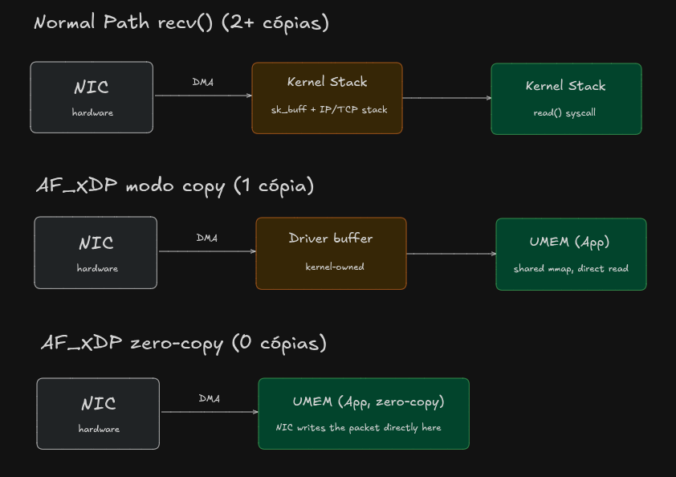

# CHALLENGE 15: XDP_REDIRECT + ZERO-COPY NEGOTIATION
**Category**: Networking / Kernel Bypass
**Time**: 1h
**Builds on**: 14-af_xdp_socket

## Study before (10-15min)

The AF_XDP socket bind flag determines the operating mode: `XDP_ZEROCOPY`
asks the driver to write the packet straight into the UMEM (no
intermediate copy); XDP_COPY accepts that the kernel copies from the
NIC's internal buffer into the UMEM (one extra copy, but works on any
driver). Without either flag, the kernel picks automatically, but in
production you want to know explicitly which mode is active, not find
out by accident.

## Understanding the data path

How and why is zero-copy so fast?



The answer is about who programs the network card's DMA descriptors.

In copy mode, the **NIC's DMA descriptors** point to the driver's internal buffer, that's where the hardware *writes the packet as soon as it arrives*, because that's the only address the driver knows and controls in this mode. After that, someone (the kernel) has to manually copy those bytes from the driver's buffer into your **UMEM**, because they're two physically different memory regions.

In zero-copy, the kernel does something deeper: it reprograms the **NIC's own DMA descriptors to point directly at your UMEM's frame addresses**. This is only possible because, on bind with `XDP_ZEROCOPY`, the NIC driver has a specific API (`ndo_bpf` with `XDP_SETUP_XSK_POOL`, which we mentioned earlier) that lets the kernel tell the hardware: "next time a packet arrives on this queue, write it here", passing the physical address of a frame in your **UMEM**, not the driver's internal buffer.

In other words: the NIC, physically, via DMA, writes the packet bytes directly into memory your Go process already sees, the hardware never touches the driver's intermediate buffer because, in this mode, that intermediate buffer simply stops being used. It's not "copying faster", it's eliminating the copy because the final destination and the DMA target are the same memory region from the start.

That's why only specific drivers support this: it requires the NIC driver to know how to do this descriptor reprogramming pointing at user memory (it's not something the generic kernel resolves on its own).

**Context**:

Challenge 14 bound the socket without specifying a mode, so the kernel
picked on its own (if there's no matching NIC it falls back to copy,
which was the case here, since r8169 does not support zero-copy). Today
you make that choice explicit and observable: try zero-copy first, fall
back to copy automatically if the bind fails, document which mode is
actually running.

What to build:

1. Bind attempting `XDP_ZEROCOPY` first
2. If the bind returns an error specific to unsupported mode, retry with
   XDP_COPY
3. Explicitly log which mode ended up active after negotiation
4. Run on a real physical interface (e.g. enp2s0f1), no longer veth, it
   now makes sense to test on real hardware, since the question here is
   about the driver

## Required:

- Mode negotiation must not mask other bind errors (only fall back to
  copy if the error is specifically about zero-copy support, not any
  error)
- README documents: the machine's driver (r8169), the mode that actually
  ran, and what would be needed to observe real zero-copy (a server NIC
  with an ixgbe/i40e/mlx5 driver)

What will be observed: whether the fallback is conditional on the right
error (not a silent catch-all that would hide real bugs), and whether
the hardware limitation was documented honestly, not hidden

---

Practical first step: do you remember which flag constant (XDP_ZEROCOPY/
XDP_COPY) and which struct it goes into for the bind, is it the same
SockaddrXDP already in use (Flags is a field of it), or somewhere else?
Take a look at the unix.SockaddrXDP you already have imported.

## What changes from challenge 14:

Stays the same:

- **UMEM**: the shared memory region continues to exist the same way,
  registered via `XDP_UMEM_REG`, same fixed-size frames. Zero-copy
  doesn't create a different memory region, it's the same region; what
  changes is only who puts the packet in there.
- **The 4 rings** (fill, completion, rx, tx): identical structure, same
  producer/consumer index mechanism, same way of reading/writing. No
  code change in fill/receive.
- The AF_XDP socket: same creation (syscall.Socket(unix.AF_XDP, ...)),
  same UMEM_FILL_RING/RX_RING setup via setsockopt.

What changes, the only new piece:

- The bind call. Today, unix.Bind(fd, sa) probably doesn't pass any flag
  in SockaddrXDP.Flags (or passes zero). Today's negotiation is: try
  bind with sa.Flags = unix.XDP_ZEROCOPY; if the kernel specifically
  refuses due to lack of driver support, redo the bind with sa.Flags =
  unix.XDP_COPY.

Conceptual difference, to fix the "why": think of the UMEM as a mailbox
shared between you and the mailman (kernel). Zero-copy = the mailman
(NIC driver) puts the letter directly into your mailbox, no middleman.
Copy mode = the mailman first receives the letter at the post office
(the NIC/kernel's internal buffer), and only then copies it into your
mailbox. The mailbox (UMEM) is the same mailbox in both cases, the only
thing that changes is whether there's an extra copy along the way or not.

So in practice, the socket.go you already have barely changes, only the
function that does the bind gains a desired-mode parameter and a
conditional retry. No need to recreate the UMEM or any of the rings.

---

## Hardware tested

- Interface: enp2s0f1
- Driver: r8169 (confirmed via readlink -f /sys/class/net/enp2s0f1/device/driver)
- Result: zero-copy bind failed with "operation not supported", r8169
  does not implement AF_XDP zero-copy (ndo_bpf XDP_SETUP_XSK_POOL).
  Fallback to copy mode succeeded, socket receives real packets
  correctly.

### How to check driver support on another machine

No need to depend on ethtool:

```bash
ip link show                                          # list interfaces
readlink -f /sys/class/net/<iface>/device/driver       # resolve the driver name
```

Drivers known to support AF_XDP zero-copy: ixgbe, i40e, ice, mlx5_core,
mlx4_en (mostly server-grade 10G+ NICs). Consumer/desktop NICs (r8169,
e1000e, most laptop wifi) generally don't support it.

### What changed relative to challenge 14

Same UMEM, same 4 rings, same socket setup, the bind now negotiates the
mode explicitly: tries XDP_ZEROCOPY first, falls back to XDP_COPY on
[actual error your errors.Is is checking], logging which mode actually
ended up active instead of letting the kernel choose silently.

### What zero-copy would require here

A server-grade NIC with a supported driver (ixgbe/i40e/ice/mlx5), not
available on this machine. The negotiation logic is correct and would
automatically use zero-copy on that kind of hardware, with no code
change.

Since this is your real interface, any normal traffic from your machine
(opening a website, ping 8.8.8.8) should already generate packets
arriving on it. No need to simulate anything like with veth:

```bash
# in another terminal, just to make sure packets are flowing
ping -c 5 8.8.8.8
```

With the fix and fallback in place:
```bash
(base) victor@pop-os:~/Pessoal/go-network-engineering/15-xdp_redirect_zero_copy$ sudo ./bin/af_xdp enp2s0f1
[sudo] password for victor: 
2026/08/07 20:42:51 WARN zero-copy bind failed, falling back to copy mode error="operation not supported"
2026/08/07 20:42:51 INFO AF_XDP socket bound in copy mode
2026/08/07 20:42:51 AF_XDP socket bound to enp2s0f1 queue 0, waiting for packets...
2026/08/07 20:42:52 packet: 114 bytes, first bytes: d4939029510964614055d76f86dd600e
2026/08/07 20:42:52 packet: 114 bytes, first bytes: d4939029510964614055d76f86dd600e
2026/08/07 20:42:53 packet: 114 bytes, first bytes: d4939029510964614055d76f86dd600b
2026/08/07 20:42:54 packet: 114 bytes, first bytes: d4939029510964614055d76f86dd600d
2026/08/07 20:42:54 packet: 66 bytes, first bytes: d4939029510964614055d76f08004500
2026/08/07 20:42:55 packet: 78 bytes, first bytes: d4939029510964614055d76f08004500
2026/08/07 20:42:55 packet: 114 bytes, first bytes: d4939029510964614055d76f86dd6005
2026/08/07 20:42:55 packet: 78 bytes, first bytes: d4939029510964614055d76f08004500
2026/08/07 20:42:56 packet: 78 bytes, first bytes: d4939029510964614055d76f08004500
```